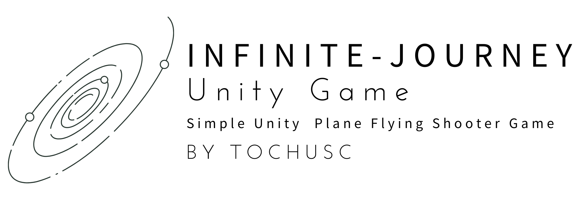
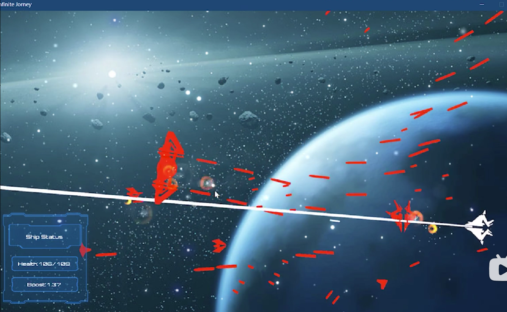
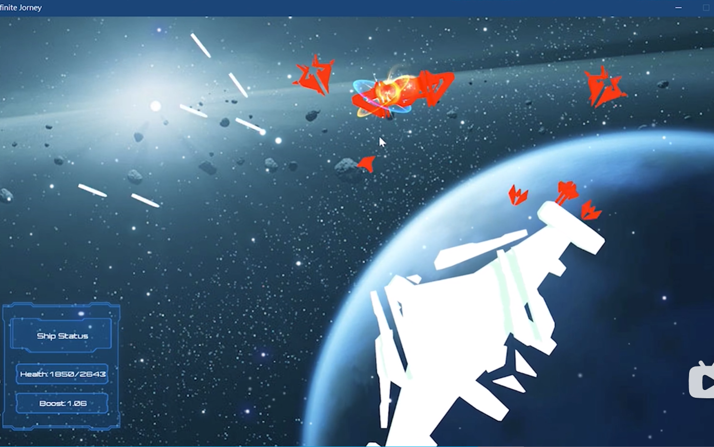
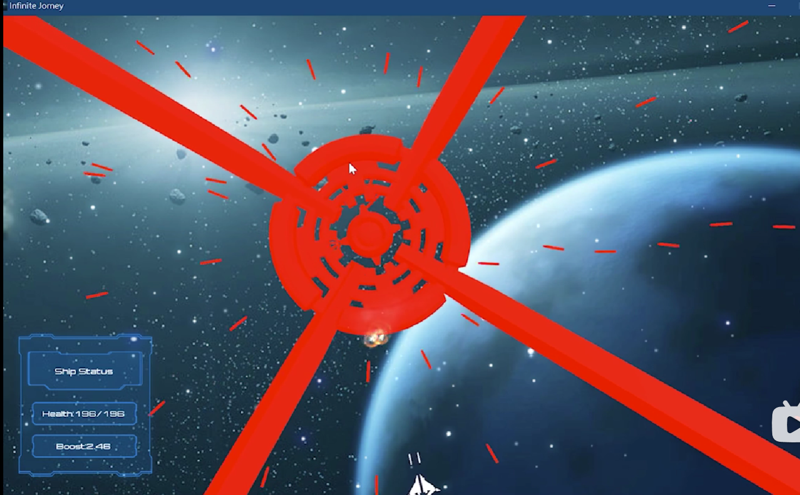
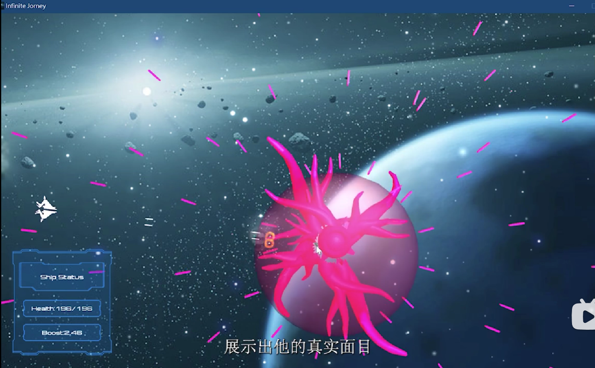

---

<h1> 无限星旅 </h1>

### 简单的Unity3D平面飞行射击小游戏

[**简体中文**](./README.md)

[Unity](https://unity.com/)72h限时游戏开发（GameJam）- 参赛作品

---

在Unity官方72h限时游戏开发中诞生的小项目。

简单的3D平面射击小游戏，模型建模均由自己完成， 配乐及部分贴图使用了开源资源。

游戏拥有巧妙的机制设计，玩家可以控制击杀自己的敌人继续游戏，

你甚至可以反控BOSS！最终BOSS有双形态和巧妙的剧情反转😉。

## 游戏画面💻

---

