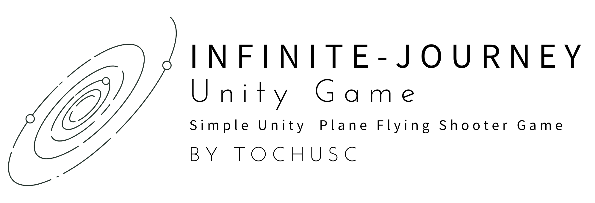
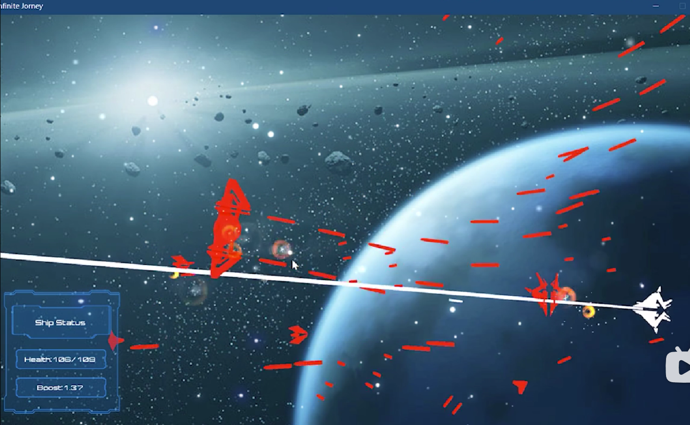
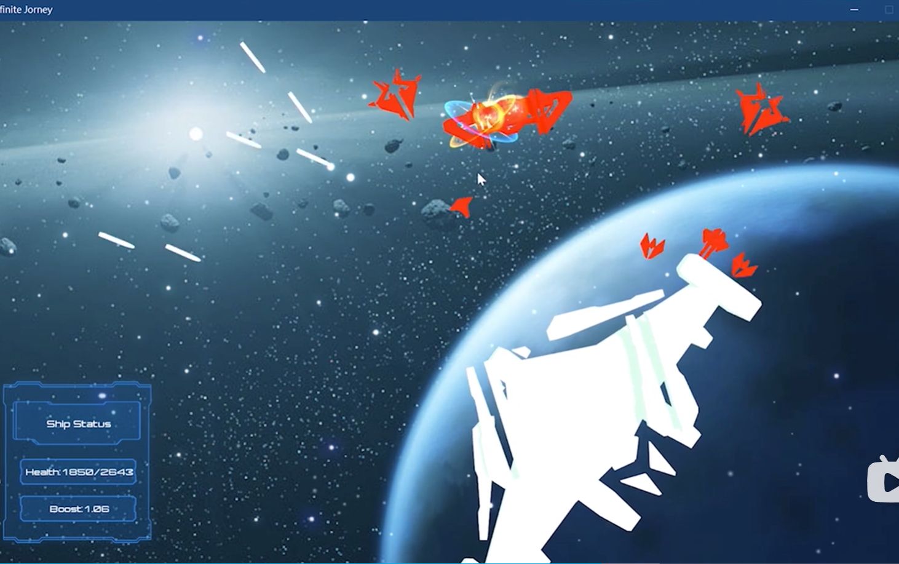
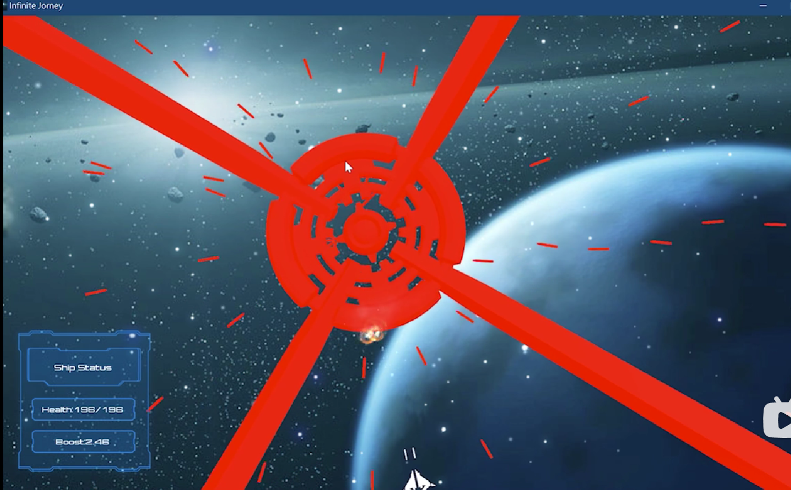
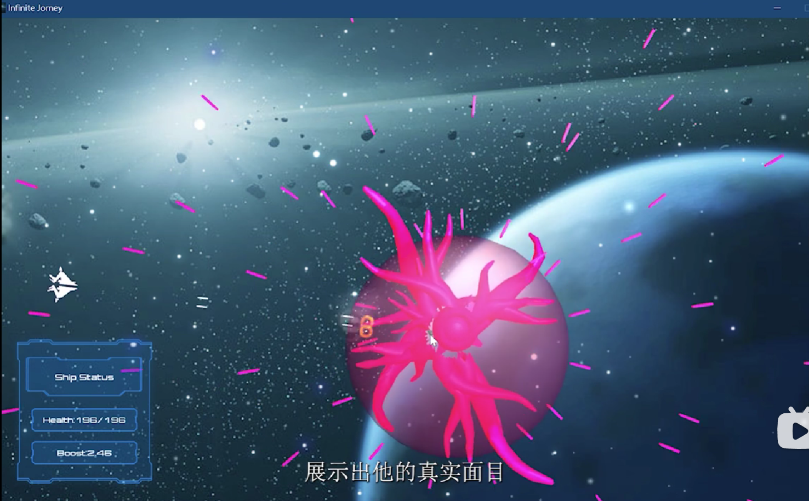

---

<h1> 无限星旅 </h1>

### 简单的Unity3D平面飞行射击小游戏

Unity72h限时游戏开发（GameJam）- 参赛作品

作品演示视频：[[Unity萌新开发挑战NewbiesJam]个人独立参赛作品《无限星旅》Infinite Journey  来看看两周的Unity学习能做到什么水平吧？](https://www.bilibili.com/video/BV1wt4y1u78m/?share_source=copy_web&vd_source=9e3eab19692004623394d513719b1b59)

---

在Unity官方72h限时游戏开发中诞生的小项目。

简单的3D平面射击小游戏，模型建模均由自己完成， 配乐及部分贴图使用了开源资源。

游戏拥有巧妙的机制设计，玩家可以控制击杀自己的敌人继续游戏，

你甚至可以反控BOSS！最终BOSS有双形态和巧妙的剧情反转😉。

## 游戏画面💻

---

